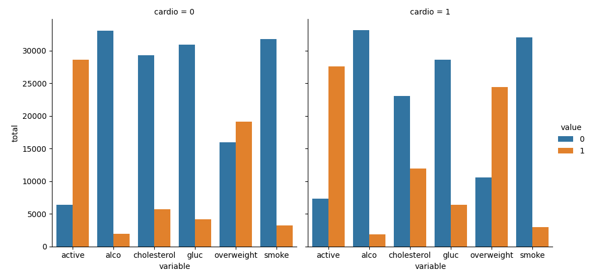
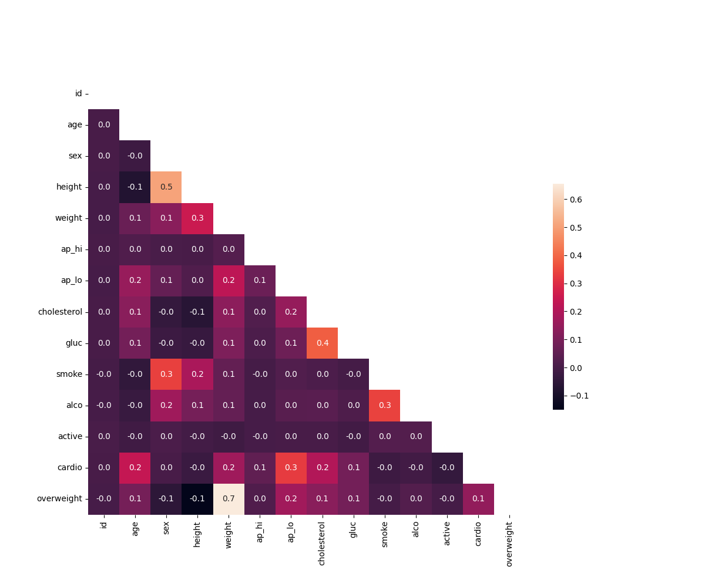

# Medical Data Visualizer

This project is part of the **freeCodeCamp Data Analysis with Python** certification. It focuses on visualizing and analyzing medical examination data using **Pandas**, **Matplotlib** and **Seaborn**. The goal is to explore the relationship between cardiovascular disease and various health/lifestyle factors.

## Table of Contents
- [Medical Data Visualizer](#medical-data-visualizer)
  - [Table of Contents](#table-of-contents)
  - [Overview](#overview)
  - [Dataset Description](#dataset-description)
  - [Visualizations](#visualizations)
    - [Categorical Plot](#categorical-plot)
    - [Heatmap](#heatmap)
  - [How to Run](#how-to-run)
    - [Locally](#locally)
  - [Testing](#testing)
  - [Notebook Exploration](#notebook-exploration)
  - [File Overview](#file-overview)
  - [What I Learned](#what-i-learned)
  - [Author](#author)
  - [Acknowledgments](#acknowledgments)

## Overview
The dataset represents medical examination data of patients, including body measurements, blood test results and lifestyle information.  
The project implements two major visualizations:

1. **Categorical Plot** – compares lifestyle/health factors (cholesterol, glucose, smoking, alcohol intake, activity, overweight) across patients with and without cardiovascular disease.  
2. **Heatmap** – shows correlations between medical measurements after cleaning the data.

The implementation passes all provided unit tests and includes a Jupyter Notebook for exploration.

## Dataset Description
Each row in the dataset represents a patient, with the following features:

| Feature | Type | Description |
|---------|------|-------------|
| age | Objective | Patient age (days) |
| height | Objective | Height (cm) |
| weight | Objective | Weight (kg) |
| gender | Objective | Gender (binary code) |
| ap_hi | Examination | Systolic blood pressure |
| ap_lo | Examination | Diastolic blood pressure |
| cholesterol | Examination | 1 = normal, 2 = above normal, 3 = well above normal |
| gluc | Examination | 1 = normal, 2 = above normal, 3 = well above normal |
| smoke | Subjective | Smoking (binary) |
| alco | Subjective | Alcohol intake (binary) |
| active | Subjective | Physical activity (binary) |
| cardio | Target | Cardiovascular disease (binary) |

## Visualizations
### Categorical Plot
- Displays counts of categorical risk factors split by `cardio` (0 = no disease, 1 = disease).
- Example output:



### Heatmap
- Shows correlations between numeric features after filtering invalid and extreme data.
- Example output:



## How to Run
### Locally
Ensure Python ≥3.8 and pip are installed.

1. **Clone the repository**
```bash
git clone https://github.com/dantvi/medical-data-visualizer.git
cd medical-data-visualizer
```

2. **Create and activate a virtual environment**
```bash
python -m venv venv
source venv/bin/activate   # On Windows: venv\Scripts\activate
```

3. **Install dependencies**
```bash
pip install -r requirements.txt
```

4. **Run the app**
```bash
python main.py
```
This will run the visualizations and execute all tests.

## Testing
Unit tests are located in `test_module.py`. They verify:

- Correct addition of the overweight column
- Normalization of cholesterol and glucose
- Proper formatting and grouping of the categorical plot
- Valid data cleaning and correct heatmap values

Run tests with:
```bash
python -m unittest -v
```

## Notebook Exploration
A Jupyter Notebook is included for educational exploration. It demonstrates step-by-step:

- Calculating BMI and adding overweight indicator
- Normalizing cholesterol and glucose
- Building the categorical plot
- Cleaning data and generating the heatmap

Launch with:
```bash
jupyter notebook
```
Then open `exploration.ipynb`.

## File Overview

| File | Purpose |
|------|---------|
| `medical_data_visualizer.py` | Core logic (data cleaning & visualizations) |
| `main.py` | Entrypoint to run tests/visualizations |
| `test_module.py` | Unit tests (unittest) |
| `medical_examination.csv` | Dataset |
| `exploration.ipynb` | Optional Jupyter Notebook exploration |
| `requirements.txt` | Project dependencies |
| `.gitignore` | Excludes venv, cache files |

## What I Learned
Through this project, I practiced:

- Data cleaning & preparation (BMI calculation, normalization, outlier removal)
- Visualization with Seaborn (categorical bar plots, annotated heatmaps)
- Correlation analysis and masking techniques
- Test-driven development with Python's unittest
- Organizing Python projects with clear structure and reproducibility

## Author
- **GitHub** – [@dantvi](https://github.com/dantvi)
- **LinkedIn** – [@danieltving](https://linkedin.com/in/danieltving)

## Acknowledgments
- [freeCodeCamp](https://www.freecodecamp.org/) – for the project and dataset
- [Pandas Docs](https://pandas.pydata.org/docs/)
- [Matplotlib Docs](https://matplotlib.org/stable/contents.html)
- [Seaborn Docs](https://seaborn.pydata.org/)
